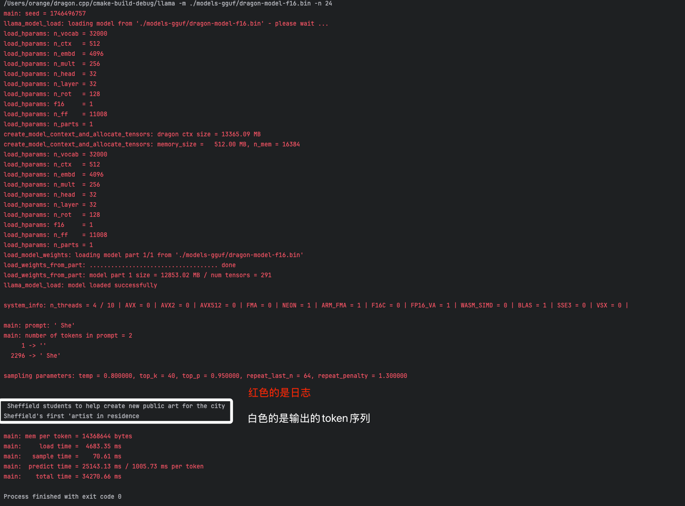

# Crazy Challenge: Inference Engine Debugging

## 项目简介

欢迎参加本次挑战！本项目旨在 CPU 上运行大型语言模型推理引擎的修改版本。

**任务：** 对提供的代码（ 主要涉及`main.cpp`, `utils.cpp`, `operators.h` 等文件）进行诊断并修复，使其能够成功加载提供的语言模型文件，并根据用户输入的提示（prompt）生成连贯的文本输出。

**注意：** 你收到的代码库中被植入了一些bug，导致项目出现**编译错误**和**程序无法按预期工作**。你需要运用你的 C++ 编程和调试技能来定位并解决这些问题。

## 构建指南

使用 CMake 构建项目：

1.  **创建构建目录:**
    ```bash
    mkdir build
    cd build
    ```

2.  **运行 CMake 配置:**
    ```bash
    cmake ..
    ```
    * 如果遇到问题，你可能需要修改 `CMakeLists.txt` 文件。 

3.  **编译项目:**
    ```bash
    make -j
    ```
    * `-j` 参数可以并行编译以加快速度。这一过程可能会出错，你需要找出问题并解决。

成功编译后，你应该能在 `build/` 目录下找到名为 `llama` (或者 `llama.exe`) 的可执行文件。

## 运行与测试

要运行推理引擎代码，请使用 `llama` 可执行文件，并至少提供模型文件的路径。

**运行步骤:**

1. 使用 huggingface-cli 从`https://huggingface.co/DengCaptain/Llama-7b`上下载Llama-7B的模型权重文件到models-hf中（如果下载过程中显示没有权限，你需要在huggingface仓库上同意仓库的规则）。
2. 使用 `conver-pth-to-dragon.py` 脚本将models-hf中的pytorch格式的模型文件转为本项目的格式，比如dragon-model-f16.bin。
3. 以上一步骤生成的模型文件作为输入参数，运行 `llama` 可执行文件。这一步你可能会遇到若干个错误，你需要找出原因并解决这些错误。
4. 当程序最终可以正常生成token序列时（如下图），你就已经解决了本任务了。


## 调试提示

*   **仔细观察启动过程：** 注意程序启动时的控制台输出，特别是与模型文件加载相关的日志信息。是否有任何错误或警告？
*   **验证关键对象状态：** 确保像模型上下文 (`dragon_context`) 这样的核心对象在初始化后被正确设置，并在后续代码中保持有效。它们的值是否符合预期？
*   **利用调试工具：** 使用 GDB 或 LLDB 等调试器单步执行代码，检查变量状态，理解控制流程。
*   **添加诊断输出：** 在关键逻辑点（如函数入口/出口、循环内部、变量赋值后）添加 `fprintf(stderr, ...)` 语句，打印变量值或执行标记，以帮助追踪问题。本项目大量使用了 `fprintf(stderr, ...)` 进行日志输出，你可以效仿。

## 提交指南

在成功修复代码并能正确运行程序之后，你需要提交一份解题报告，内容应至少包括：

1.  **Bug 定位：** 清晰地说明你找到了哪些 bugs，并指出每个 bug 所在的具体文件和代码行号（修复前的行号）。
2.  **Bug 分析：** 详细解释每个 bug 产生的原因。例如，是逻辑错误、变量使用不当、状态管理问题、文件格式不匹配，还是其他原因？
3.  **Bug 修复：** 描述你对每个 bug 采取的具体修复措施。可以附上修改后的关键代码片段。
4.  **最终结果：** 提供你用于测试的最终运行命令，并附上一段程序成功运行后截图，以证明你的修复是有效的。

---

时间限制：**12小时**。祝您好运！
